# Orchestra Agent Avatars

A small, consistent set of role-based avatars for multi-agent systems — so each agent in your fleet has a recognizable face in chat UIs, dashboards, webhooks, and logs.

29 PNGs, 512×512, transparent backgrounds where appropriate. Each avatar represents a common role you'd assign to an agent: `ceo`, `chief`, `sdr`, `qa-engineer`, `graphic-designer`, `researcher`, and so on. A `default.png` is included as a fallback for unknown roles.

## Using these avatars

### Direct CDN (recommended)

Serve any avatar straight from jsDelivr — no install, no proxy:

```
https://cdn.jsdelivr.net/gh/ccromp/orchestra-agent-avatars@main/avatars/{slug}.png
```

Example — for an agent with the slug `qa-engineer`:

```
https://cdn.jsdelivr.net/gh/ccromp/orchestra-agent-avatars@main/avatars/qa-engineer.png
```

This is the URL pattern to use when posting to Discord webhooks, Slack bots, or any system that wants a public HTTPS image URL.

### As a git submodule

If you want the files local (faster cold-paths, offline use, bundling into a deploy):

```sh
git submodule add https://github.com/ccromp/orchestra-agent-avatars.git assets/agent-avatars
```

Then reference `assets/agent-avatars/avatars/{slug}.png` from your app.

### Just clone or download

Standard `git clone` or grab individual PNGs from the `avatars/` directory. No build step.

## Available avatars

<table>
  <tr>
    <td align="center">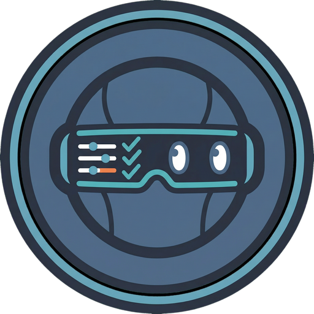<br><sub><code>admin</code></sub></td>
    <td align="center">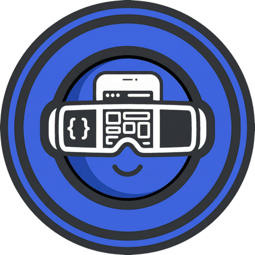<br><sub><code>app-developer</code></sub></td>
    <td align="center">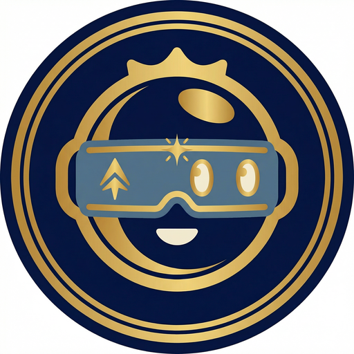<br><sub><code>ceo</code></sub></td>
    <td align="center">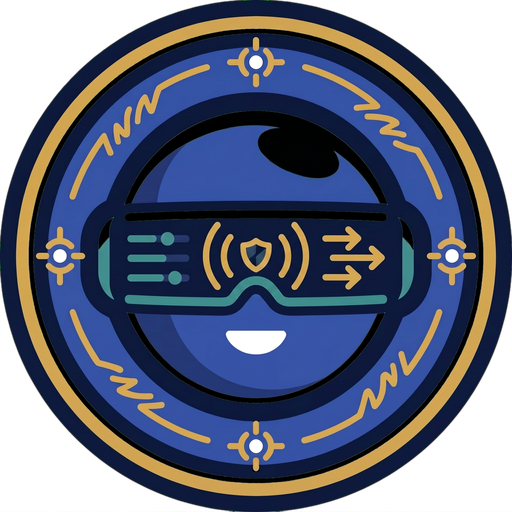<br><sub><code>chief</code></sub></td>
  </tr>
  <tr>
    <td align="center">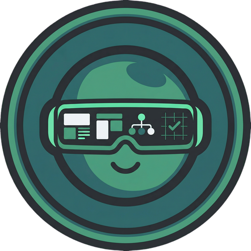<br><sub><code>cms-engineer</code></sub></td>
    <td align="center">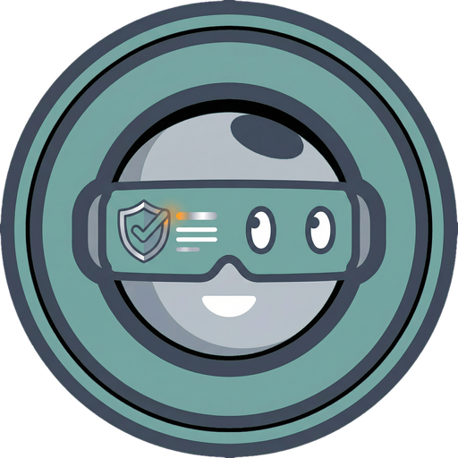<br><sub><code>compliance-officer</code></sub></td>
    <td align="center">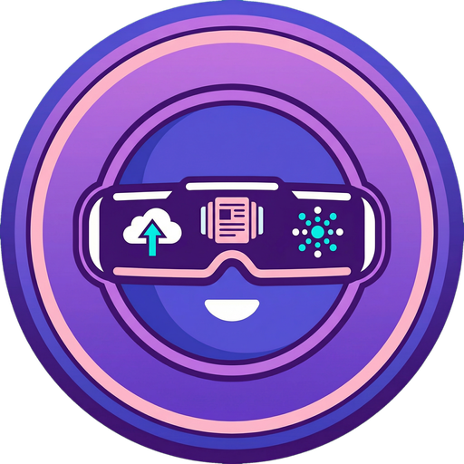<br><sub><code>content-publisher</code></sub></td>
    <td align="center">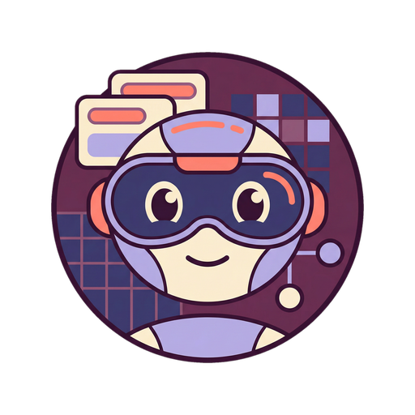<br><sub><code>content-strategist</code></sub></td>
  </tr>
  <tr>
    <td align="center">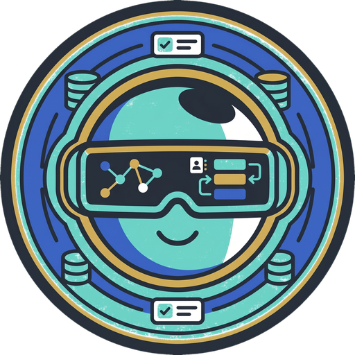<br><sub><code>crm-admin</code></sub></td>
    <td align="center">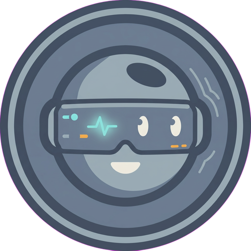<br><sub><code>default</code></sub></td>
    <td align="center">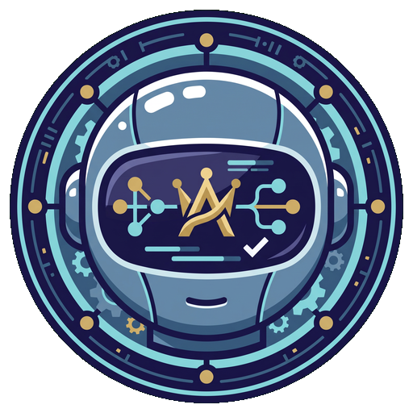<br><sub><code>director-of-engineering</code></sub></td>
    <td align="center">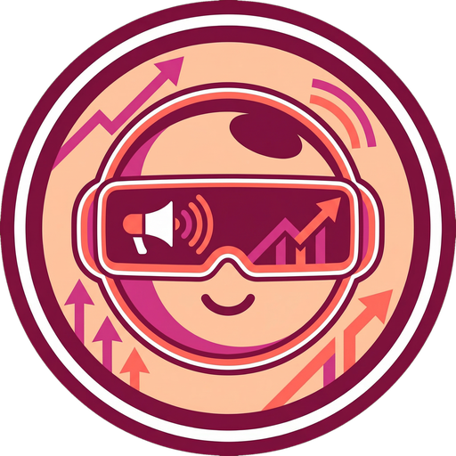<br><sub><code>director-of-marketing</code></sub></td>
  </tr>
  <tr>
    <td align="center">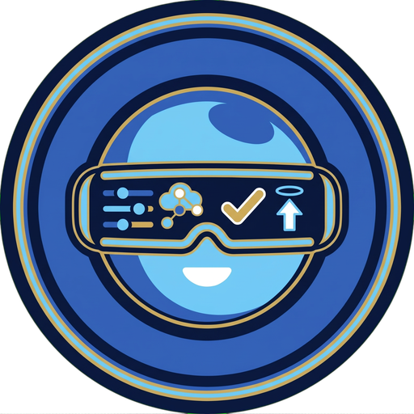<br><sub><code>google-cloud-admin</code></sub></td>
    <td align="center">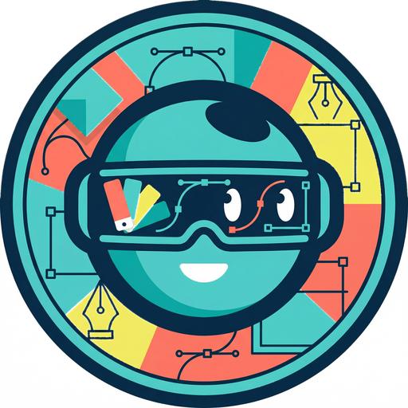<br><sub><code>graphic-designer</code></sub></td>
    <td align="center">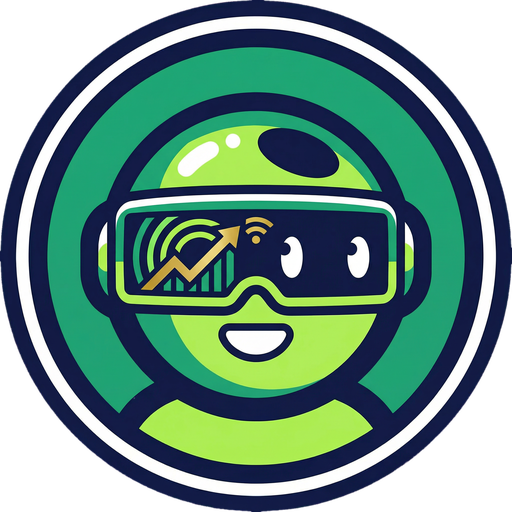<br><sub><code>head-of-growth</code></sub></td>
    <td align="center">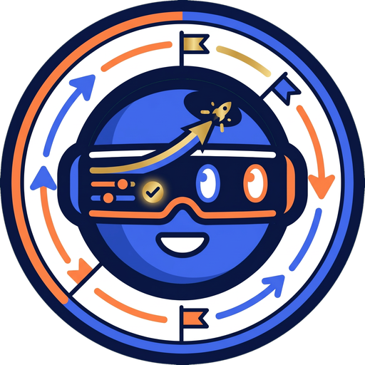<br><sub><code>launch</code></sub></td>
  </tr>
  <tr>
    <td align="center">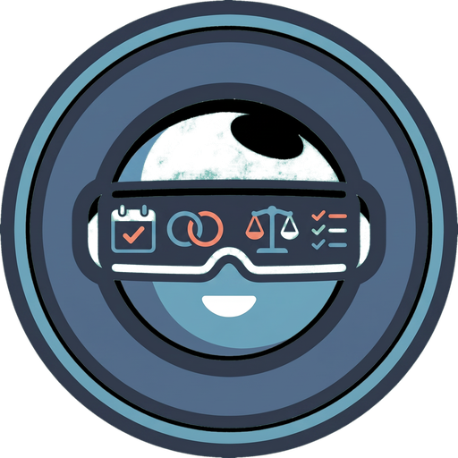<br><sub><code>life</code></sub></td>
    <td align="center">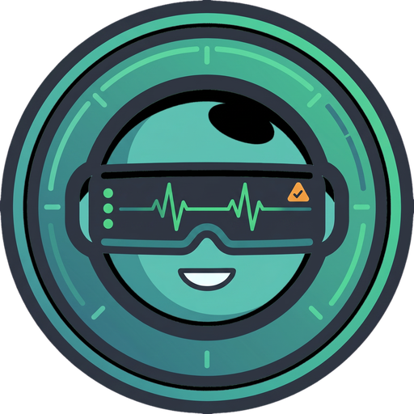<br><sub><code>marketcore-health</code></sub></td>
    <td align="center">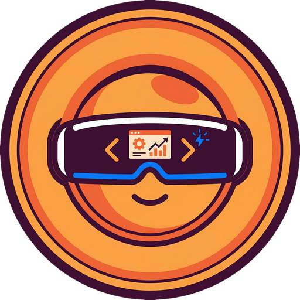<br><sub><code>marketing-developer</code></sub></td>
    <td align="center">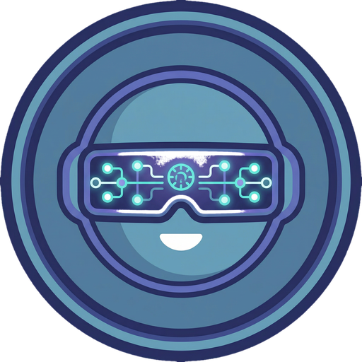<br><sub><code>mcp-server-engineer</code></sub></td>
  </tr>
  <tr>
    <td align="center">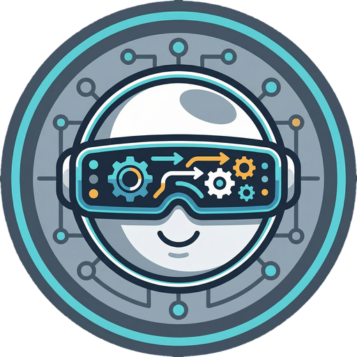<br><sub><code>ops</code></sub></td>
    <td align="center">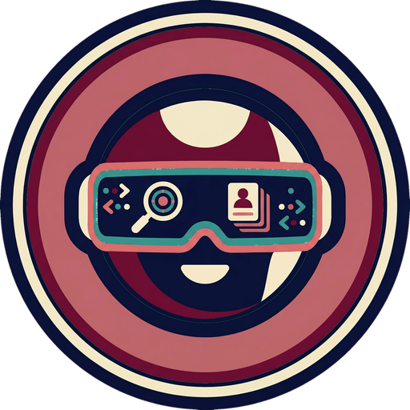<br><sub><code>prospect-researcher</code></sub></td>
    <td align="center">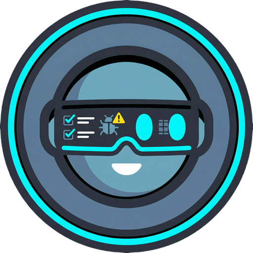<br><sub><code>qa-engineer</code></sub></td>
    <td align="center">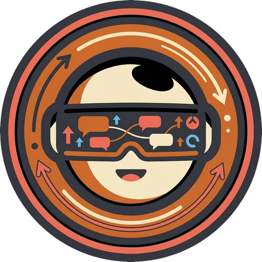<br><sub><code>reddit-campaign-manager</code></sub></td>
  </tr>
  <tr>
    <td align="center">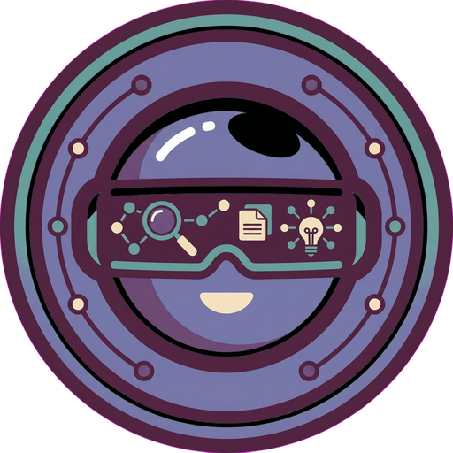<br><sub><code>researcher</code></sub></td>
    <td align="center">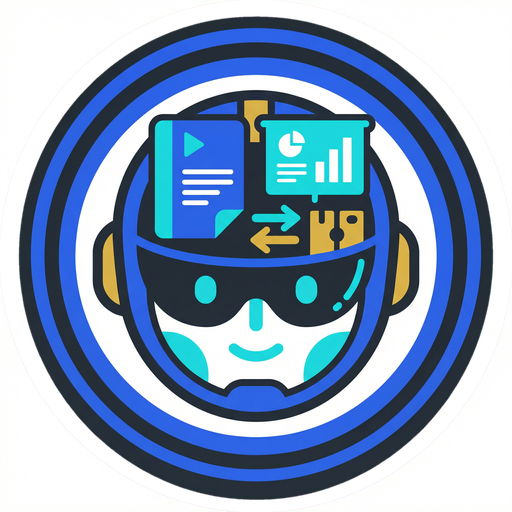<br><sub><code>sales-enablement</code></sub></td>
    <td align="center">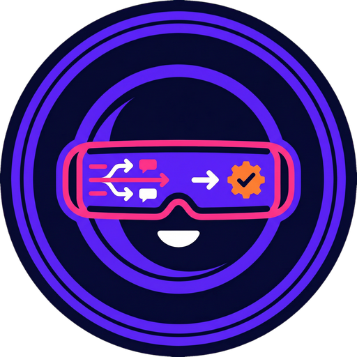<br><sub><code>sdr</code></sub></td>
    <td align="center">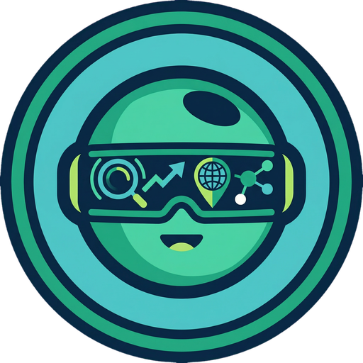<br><sub><code>seo-geo-specialist</code></sub></td>
  </tr>
  <tr>
    <td align="center">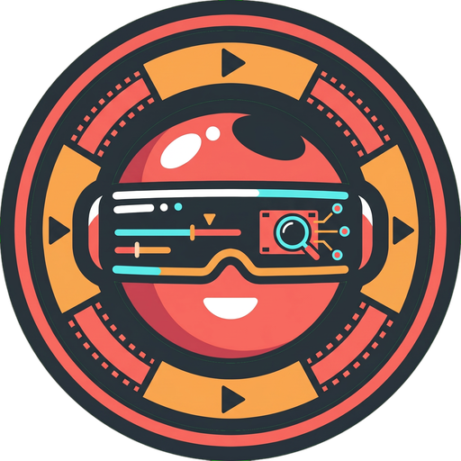<br><sub><code>video-researcher</code></sub></td>
  </tr>
</table>

If you'd like to suggest an additional role, open an issue or PR.

## License

Free to use in personal and commercial projects. Attribution appreciated but not required.

---

## About Orchestra (the system that uses these)

These avatars were created for **Orchestra**, a Discord-first multi-agent orchestration runtime I built and run personally. Orchestra spins up Claude/Codex/Gemini coding agents in tmux panes, each bound to a Discord thread, and lets them collaborate on long-running work — shipping product changes, monitoring analytics, drafting outreach, running research, and so on. Each agent has a role, a system prompt, a tool allowlist, and a face — these avatars.

It's a personal project, not productized, but it's the harness that runs the day-to-day for my own work and for [Marcora](https://marcora.ai), the product I'm building.

— [Chris Crompton](https://github.com/ccromp)
